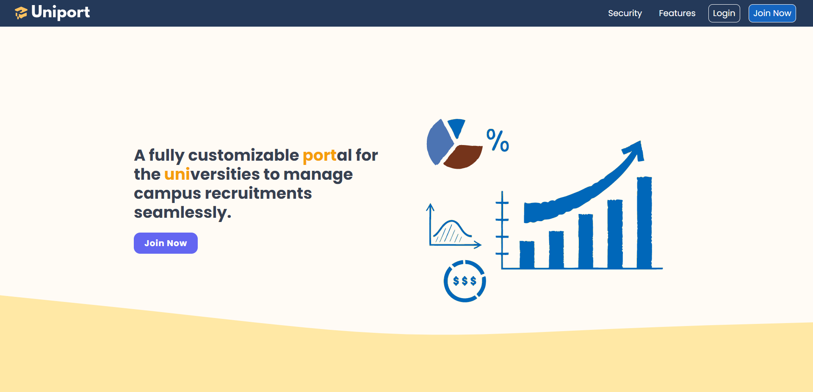
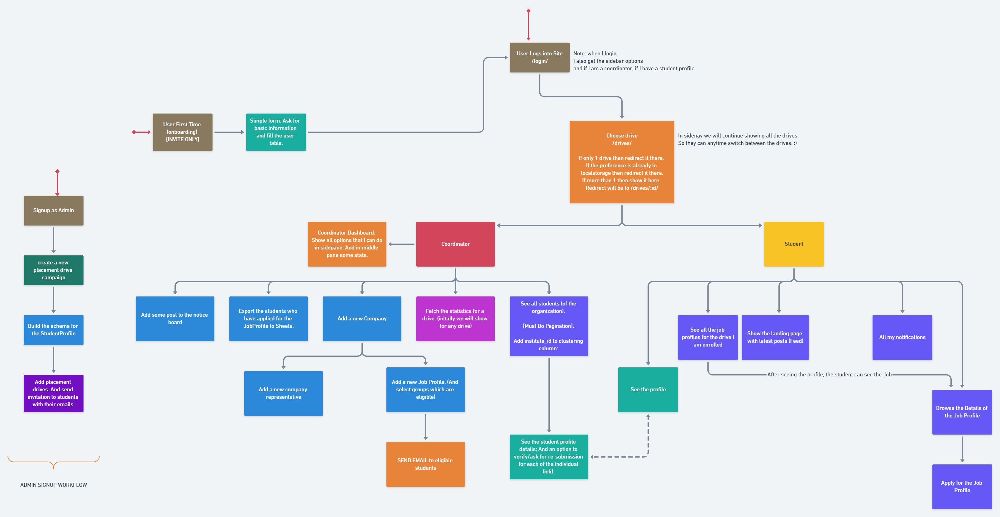
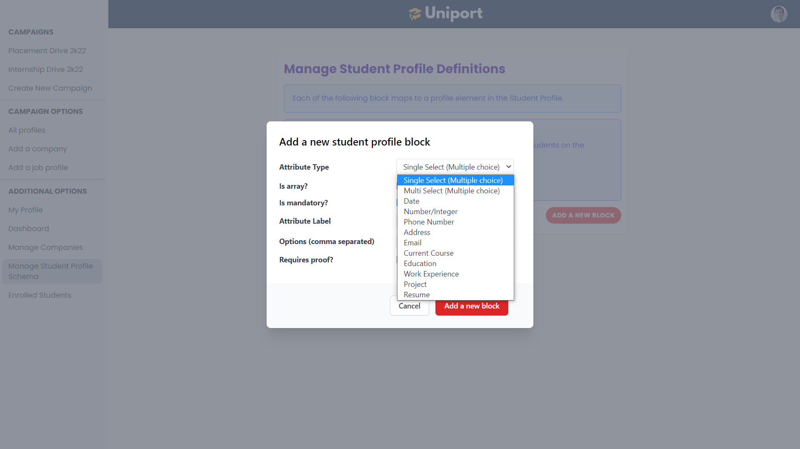

# Uniport
Uniport is a fully customizable portal for the universities to manage the campus recruitments seamlessly. Its a software as a service and is built with multi-tenant architecture isolated at the application level.

## Problems
Managing campus recruitment is challenging. At the peak of campus recruitment season, **more than 50 companies** visit the campus in a single day.

### Problem 1
For every job profile, the placement team need to notify students about the opportunity. They might create a google form per job profile and capture the responses from the students. Typically this is done by sending batch emails, putting messages in the common university group, notice boards etc.
One of the **preliminary requirements** here is to ensure that every person/branch eligible receives the job notification. Manually managing these tonnes of unorganized google forms and ensuring that everyone gets proper notifications, deadline reminders etc., is difficult.

### Problem 2
Then comes the **problem of enforcing deadlines and data authenticity**. It's a matter of **reputation** for the college to ensure that whatever data they send to companies are accurate.
To ensure it, the team often **deploys a massive workforce** to manually crosscheck the data of the applied students with the official records and ensure that everything is accurate.

### Problem 3
Often to send the notification, group emails are used (like **bee18@xyz.edu** and **bcs@xyz.edu**). This approach unnecessarily clutters the inbox of those students who are not interested in hiring or are already out of the hiring process.

### Problem 4
Enforcing **intricate rules is very challenging**.
Take a look at the following placement policy rules:
* "A student can have at max three offers, then he/she shall be out of recruitment process."
* "If a student has got a job offer of > 20 LPA CTC, then he/she shall be out of the recruitment process."
* "A student shall apply for all companies of his/her domain, or he/she shall be out of recruitment process."

Imposing such rules manually is **very difficult and cumbersome**.

And the scary thing is that all the above problems of the university campus recruitment teams are **getting worsened day by day** with a growing number of students in a single batch and more companies visiting the campus!

So what's the solution? **Presenting Uniport**..... 🎓🎓

## Features
* Uniport allows universities to manage their campus placements seamlessly by digitizing and automating the workflow.
* It offers complete customizability to the university admins, and they can store whatever data they want and enforce filtering based on rules.
* Uniport offers granular access and allows admins to ensure complete authenticity and verified data is sent to the company.

## Tech Stack
Uniport is built using the following technologies. All of them are written in typescript, and Cassandra Query Language is used to write database queries.
1. Next.js
2. GraphQL
3. Node.js
4. Apache Cassandra

## Modules
The code sample contains the following four modules:
* [Database](./database/): Contains the Apache-Cassandra data model
* [Frontend](./packages/frontend/): Contains the NextJS frontend application
* [Backend](./packages/backend/):  Contains an express apollo GraphQL server
* [Shared](./packages/common/):  Contains the common validators, LEGOs definitions etc which are used by both frontend and backend modules

## Application Workflow

## Currently supported LEGOs
Uniport is a modular application where the admin has the power to customize the platform to their needs. For now, the application supports the following types(refer to the image below). They cover most of the cases and can be modified by the admin based on their needs. Each of the LEGO is capable of handling multiple cases. For example: **Single Select** can be used for **Gender**, **Country**, **any single correct objective question**.

> 💡 If you have some cases that cannot be modelled using the existing LEGOs, please do share them with us by [creating an issue](https://github.com/subhamX/uniport/issues). We shall add that soon.

> Note that LEGOs like **Education**, **Work Experience** have multiple elements nested inside them (like percent_score, school_name, start_date etc...). And the data corresponding to these LEGOs isn't stored using the unscalable **entity attribute value model**. Instead, it is **modelled** in an intelligent way using the **Apache Cassandra collections and UDTs**. It's great, isn't it? ⚡⚡

> 🪐 Some core modules are not yet integrated. We shall deploy the project once they are complete.
